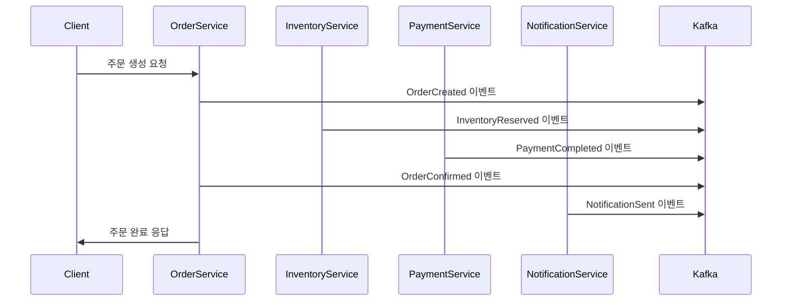
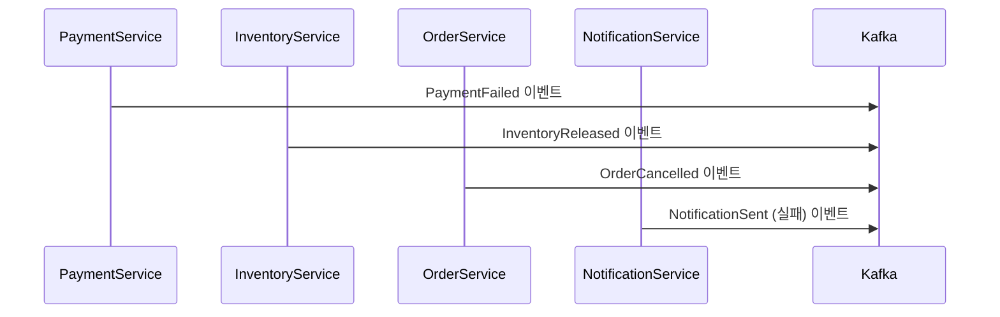

# 🛒 E-commerce Order Processing System with SAGA Pattern

Apache Kafka 기반 SAGA 패턴으로 구현된 E-commerce 주문 처리 시스템입니다. 주문 생성부터 완료까지의 전체 플로우를 이벤트 드리븐 아키텍처로 처리하며, 분산 트랜잭션의 일관성을 보장합니다.

## 📋 프로젝트 개요

- **주제**: E-commerce 주문 처리 시스템
- **목표**: Kafka 기반 SAGA 패턴 구현
- **예상 기간**: 3-4주
- **아키텍처**: 마이크로서비스 + 이벤트 드리븐 + SAGA 패턴

## 🏗️ 시스템 아키텍처

```
┌─────────────────┐    ┌─────────────────┐    ┌─────────────────┐
│  Order Service  │    │ Payment Service │    │Inventory Service│
│                 │    │                 │    │                 │
│ - 주문 생성/조회   │    │ - 결제 처리        │    │ - 재고 확인/차감   │
│ - 주문 상태 관리   │    │ - 가상 결제        │    │ - 재고 관리       │
└─────────────────┘    └─────────────────┘    └─────────────────┘
         │                       │                       │
         └───────────────────────┼───────────────────────┘
                                 │
                    ┌─────────────────┐
                    │   Apache Kafka  │
                    │                 │
                    │ - 이벤트 브로커    │
                    │ - SAGA 오케스트레이터│
                    └─────────────────┘
                                 │
                                 │
                    ┌─────────────────┐
                    │Notification Svc │
                    │                 │
                    │ - 알림 발송       │
                    │ - 이메일/SMS      │
                    └─────────────────┘
```

## 🛠️ 기술 스택

### Backend
- **Spring Boot 3.x** - 마이크로서비스 프레임워크
- **Spring Kafka** - Kafka 프로듀서/컨슈머
- **Spring Data JPA** - 데이터 접근 계층

### Message Queue & Event Streaming
- **Apache Kafka** - 이벤트 브로커 (KRaft 모드)
- **JSON** - 이벤트 스키마 직렬화

### Database
- **MySQL 8.0** - 각 서비스별 독립 데이터베이스
- **Redis** - 캐싱 및 세션 저장소

### Monitoring & Observability
- **Kafdrop** - Kafka 관리 인터페이스
- **애플리케이션 로그** - 로그 수집 및 분석

### Infrastructure
- **Docker & Docker Compose** - 컨테이너화
- **GitHub Actions** - CI/CD 파이프라인

### Testing & Performance
- **k6** - 부하 테스트
- **JUnit 5** - 단위 테스트
- **TestContainers** - 통합 테스트

## 🚀 빠른 시작

### 사전 요구사항
- Docker & Docker Compose
- Java 17+
- Gradle 7.x+

### 1. 저장소 클론
```bash
git clone <repository-url>
cd kafka-msa
```

### 2. 인프라 실행
```bash
docker-compose up -d
```

### 3. 애플리케이션 실행
```bash
./gradlew bootRun
```

### 4. 서비스 접속
- **Kafdrop (Kafka UI)**: http://localhost:9000
- **Order Service**: http://localhost:8081
- **Payment Service**: http://localhost:8082
- **Inventory Service**: http://localhost:8083
- **Notification Service**: http://localhost:8084

## 📦 서비스 구성

### 1. Order Service
- **포트**: 8081
- **기능**: 주문 생성/조회, 주문 상태 관리
- **이벤트**: `OrderCreated`, `OrderConfirmed`, `OrderCancelled`
- **SAGA**: 주문 생성 → 재고예약 → 결제처리 → 주문확정 → 알림발송

### 2. Payment Service
- **포트**: 8082
- **기능**: 결제 처리, 가상 결제 게이트웨이
- **이벤트**: `PaymentRequested`, `PaymentCompleted`, `PaymentFailed`

### 3. Inventory Service
- **포트**: 8083
- **기능**: 재고 확인/차감, 재고 관리
- **이벤트**: `InventoryReserved`, `InventoryReleased`, `InventoryShortage`

### 4. Notification Service
- **포트**: 8084
- **기능**: 알림 발송, 이메일/SMS 처리
- **이벤트**: `NotificationSent`

## 🔄 SAGA 패턴 이벤트 플로우

### 성공 플로우


### 실패 및 보상 트랜잭션


### 주요 이벤트
- **주문 관련**: `OrderCreated`, `OrderConfirmed`, `OrderCancelled`
- **결제 관련**: `PaymentRequested`, `PaymentCompleted`, `PaymentFailed`
- **재고 관련**: `InventoryReserved`, `InventoryReleased`, `InventoryShortage`
- **알림 관련**: `NotificationSent`

## 📊 성능 지표 및 모니터링

### 핵심 성과 지표 (KPI)
- **처리량**: 초당 처리 가능한 주문 수 (목표: 1000 TPS)
- **응답시간**: 주문 생성부터 완료까지 평균 시간 (목표: < 5초)
- **성공률**: 전체 주문 중 성공적으로 처리된 비율 (목표: > 99%)
- **복구시간**: 장애 발생 시 정상화까지 걸리는 시간 (목표: < 30초)

### 모니터링 도구
- **Kafdrop**: Kafka 토픽별 메시지 확인
- **애플리케이션 로그**: 각 서비스별 처리 시간 로깅
- **MySQL Slow Query**: 데이터베이스 성능 모니터링

## 🧪 테스트

### 단위 테스트
```bash
./gradlew test
```

### 통합 테스트
```bash
./gradlew integrationTest
```

### 테스트 데이터 생성
```bash
# 테스트 데이터 생성 (상품 1000만개, 사용자 100만개, 재고 정보)
./gradlew bootRun --args='--spring.profiles.active=testdata'
```

### 부하 테스트
```bash
# k6 실행 (100/500/1000 TPS 테스트)
k6 run load-test/order-creation.js

# 테스트 결과 확인
k6 run --out json=results.json load-test/order-creation.js
```

## 📈 성능 목표 및 최적화

### 성능 목표
- **동시 주문 처리**: 1000 TPS
- **평균 주문 완료 시간**: < 5초
- **이벤트 처리 지연시간**: < 1초
- **시스템 가용률**: 99.9%

### 최적화 전략
- **Kafka 설정 튜닝**: `batch.size`, `linger.ms` 조정
- **파티션 수 최적화**: 토픽별 파티션 수 조정
- **MySQL 인덱스 최적화**: 쿼리 성능 향상
- **Redis 캐싱**: 재고 정보 캐싱으로 DB 부하 감소
- **커넥션 풀 크기 조정**: 데이터베이스 연결 최적화

## 🔧 개발 가이드

### 이벤트 스키마 정의
```json
{
  "type": "OrderCreatedEvent",
  "data": {
    "orderId": "string",
    "userId": "string",
    "productId": "string",
    "quantity": "number",
    "totalAmount": "number",
    "timestamp": "long"
  },
  "metadata": {
    "correlationId": "string",
    "version": "string",
    "source": "string"
  }
}
```

### 새로운 서비스 추가
1. 서비스 모듈 생성
2. 이벤트 스키마 정의
3. Kafka Producer/Consumer 구현
4. API 엔드포인트 구현
5. 테스트 코드 작성

### 예외 상황 처리
- **멱등성 보장**: 중복 이벤트 처리 방지
- **타임아웃 처리**: 각 단계별 5분 제한
- **Dead Letter Queue**: 실패한 메시지 재처리
- **Circuit Breaker**: 장애 서비스 격리

## 🚨 장애 대응

### 장애 시뮬레이션
- **Payment Service 강제 다운**: 보상 트랜잭션 동작 확인
- **MySQL 커넥션 끊김**: 재연결 로직 확인
- **Kafka 브로커 재시작**: 메시지 손실 여부 확인

### 복구 절차
1. 장애 서비스 식별 및 격리
2. 로그 분석 및 원인 파악
3. 보상 트랜잭션 실행
4. 서비스 재시작 및 데이터 일관성 검증
5. 정상 동작 확인

## 📚 API 문서

각 서비스별 API 문서는 다음 URL에서 확인할 수 있습니다:
- **Order Service**: http://localhost:8081/swagger-ui.html
- **Payment Service**: http://localhost:8082/swagger-ui.html
- **Inventory Service**: http://localhost:8083/swagger-ui.html
- **Notification Service**: http://localhost:8084/swagger-ui.html

### 주요 API 엔드포인트
- `POST /api/orders` - 주문 생성
- `GET /api/orders/{orderId}` - 주문 조회
- `POST /api/payments` - 결제 처리
- `GET /api/inventory/{productId}` - 재고 확인
- `POST /api/notifications` - 알림 발송

## 📅 개발 일정 및 체크리스트

### 1주차 목표
- [ ] 로컬 환경에서 4개 서비스 모두 정상 실행
- [ ] 기본 CRUD API 동작 확인
- [ ] Kafka 토픽 생성 및 메시지 송수신 테스트
- [ ] 각 서비스별 MySQL 스키마 생성
- [ ] 기본 테스트 데이터 INSERT

### 2주차 목표
- [ ] SAGA 성공 플로우 완전 동작
- [ ] 보상 트랜잭션 로직 구현 완료
- [ ] 기본 예외 상황 처리 (멱등성, 타임아웃)
- [ ] Dead Letter Queue 구현

### 3주차 목표
- [ ] 부하 테스트로 TPS 측정 완료 (100/500/1000 TPS)
- [ ] 주요 장애 시뮬레이션 완료
- [ ] 성능 데이터 수집 및 분석
- [ ] 최적화 적용

### 4주차 목표
- [ ] 문서화 완료 (README, 아키텍처 다이어그램)
- [ ] 코드 정리 및 리팩토링
- [ ] GitHub 포트폴리오 완성

## 🎉 예상 결과물

### GitHub 저장소
- 완전히 동작하는 소스코드
- Docker Compose 설정
- 부하 테스트 스크립트

### 성능 데이터
- "초당 1000건 주문 처리 가능" 구체적 수치
- 평균 응답시간 < 5초
- 성공률 > 99%

### 기술 블로그
- SAGA 패턴 구현 과정
- 트러블슈팅 경험
- 성능 최적화 노하우